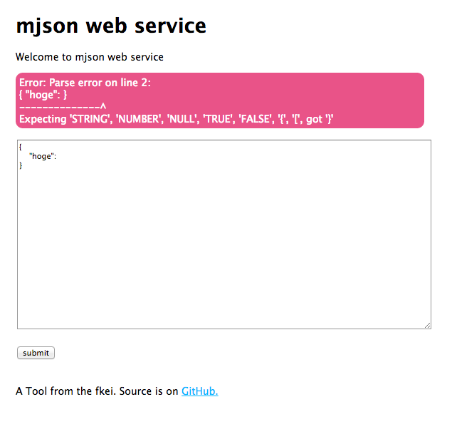

mjson-server
============

You can run the mjson via a browser.

# Overview

- Output a formatted neatly JSON.
- Eliminates comments in JSON using JSON.minify.
- For JSON parse error, and an error of jsonlint.


# install

```sh
$ npm install mjson-server -g 
$ mjson-server 
Express server listening on port 3000

Browser access: http://0.0.0.0:3000/
```

# ScreenShots





# source install 

```sh
$ git checkout https://github.com/fkei/mjson-server.git
$ cd mjson-server
$ npm install . 
$ node app
Express server listening on port 3000

Browser access: http://0.0.0.0:3000/
```

# License

The MIT License (MIT)
